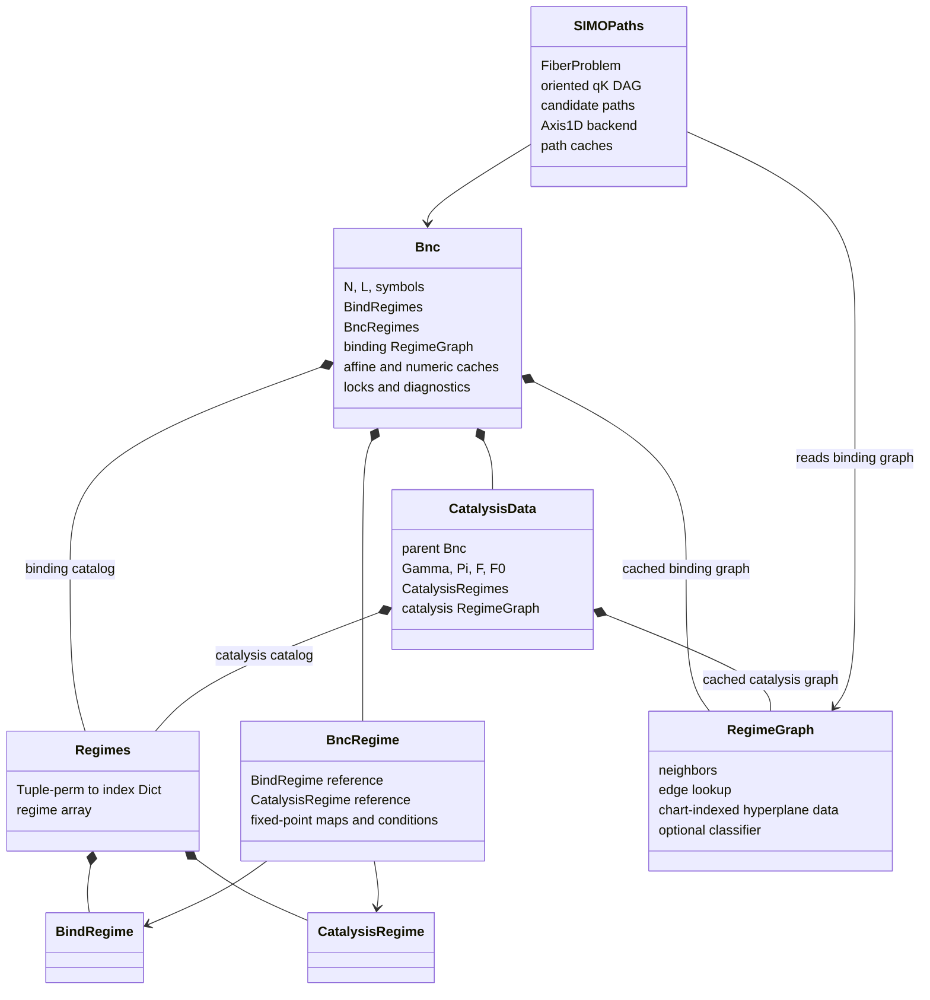
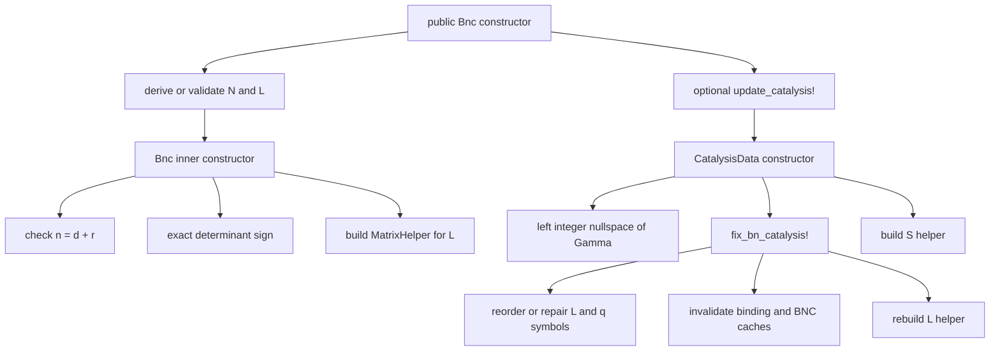
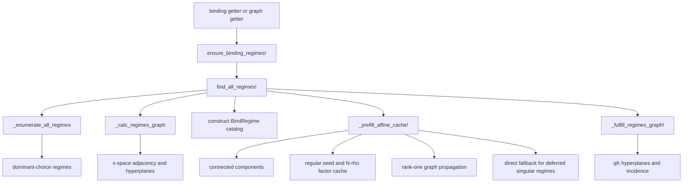
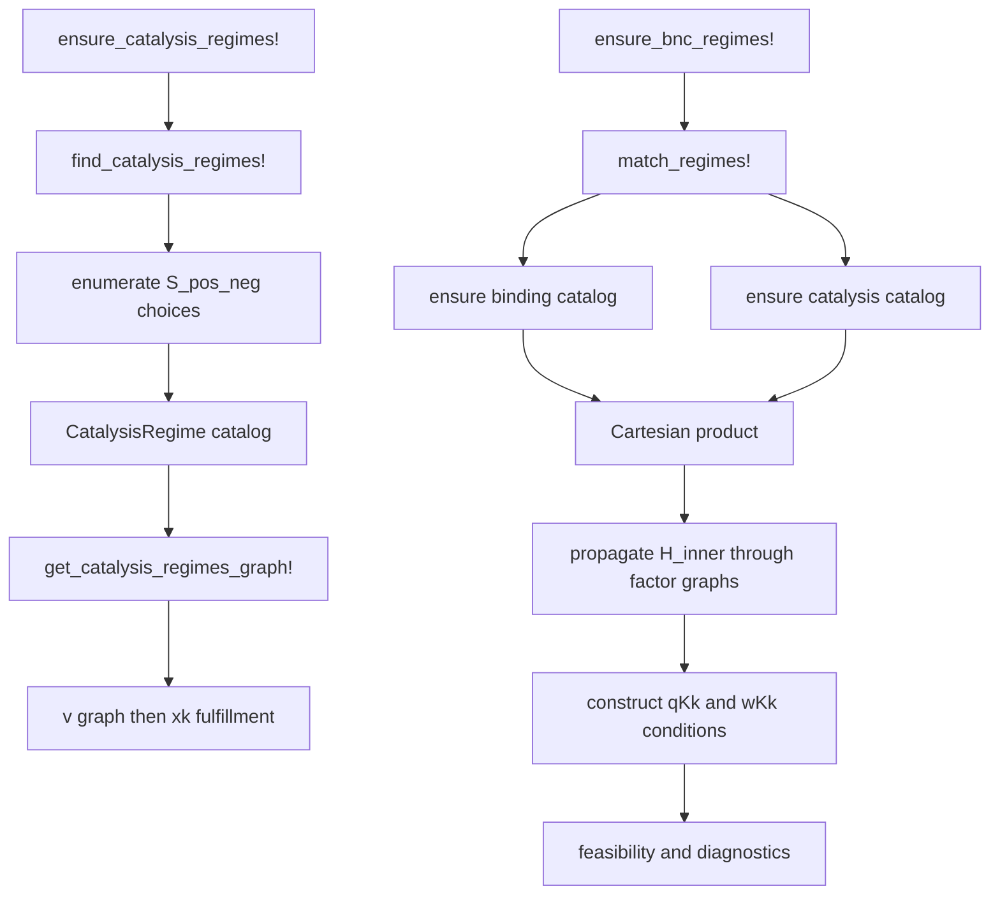
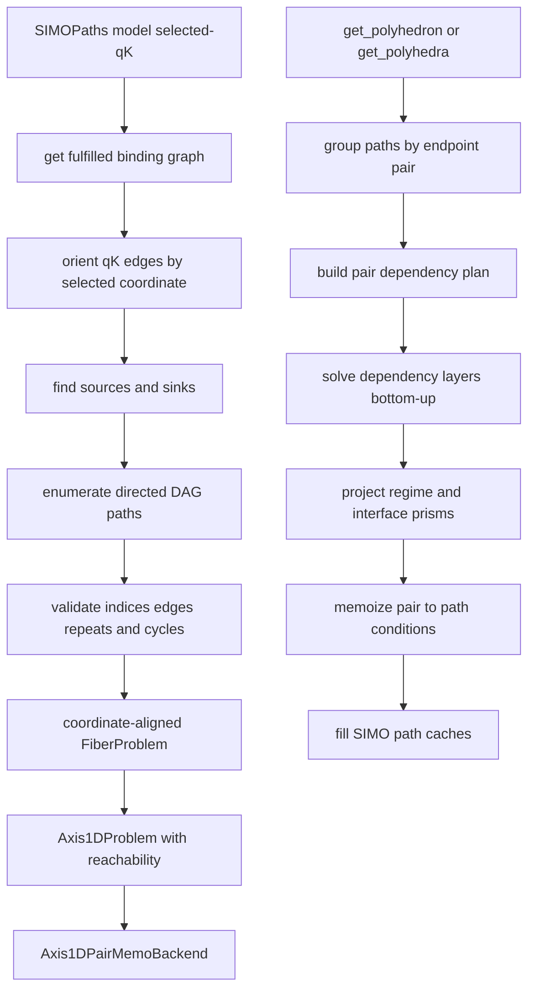

# BindingAndCatalysis.jl 数据结构、调用关系与总体架构审计

> 审计基线：`vibe` 分支，commit `2a120a8`，2026-08-17。
> 本文是一次面向维护者的源码审计快照；当前架构的规范性说明仍以根目录的
> [`Architecture.md`](../Architecture.md) 为准。

## 1. 结论摘要

当前代码的算法主干可以概括为：

```text
矩阵与精确表达式编译
        ↓
binding / catalysis regime catalog
        ↓
多坐标空间 regime graph
        ↓
binding × catalysis 的 BNC fixed-point regimes
        ↓
fiber slice solver（SIMO 是 coordinate-aligned 1D specialization）
        ↓
assignment / constraints / stability / dynamics / volume / symbolics
```

这个主干是合理的。尤其是以下两个边界已经比较清楚：

1. `RegimeGraph` 负责 regime 邻接和不同坐标系中的界面；
2. `FiberProblem` 描述允许变化的子空间，而 `Axis1DPairMemoBackend` 只负责当前已经实现的一维条件求解。

当前维护复杂度主要不来自核心数学，而来自三件事：

- 大多数源码文件都注入同一个 `BindingAndCatalysis` 模块，文件加载顺序同时承担依赖管理；
- `Bnc` 既是输入模型，也是编译结果、缓存容器、锁和诊断信息的所有者；
- 公共 getter、lazy materialization、legacy wrapper 共用大量多义 generic，读操作经常同时写缓存。

需要特别记住的当前事实是：

- binding graph 缓存在 `Bnc.vertices_graph`；
- catalysis graph 缓存在 `CatalysisData.vertices_graph`；
- **BNC graph 当前不缓存，`get_bnc_regimes_graph!` 每次都重新构建**；
- `VariationSubspace` 和 `FiberChart` 能表达一般 $k$ 维 fiber，但生产求解器只实现了 coordinate-aligned $k=1$；
- SIMO path condition 是路径在 base 参数空间中的闭存在集，不等同于互不重叠的 chamber；
- `perm` 是每行 dominant choice 的向量，不是双射 permutation；稳定的语义标签应使用 tuple，而不是 cache-local index。

## 2. 模块边界与源码分层

### 2.1 实际模块边界

包内绝大多数 `.jl` 文件不是独立 Julia module，而是按顺序 include 到
`BindingAndCatalysis` 主模块。真正隔离的模块只有：

- `ExactTypes`：精确对数表达式，见
  [`src/ExactTypes.jl`](../src/ExactTypes.jl#L1)；
- `DStable`：D-stability 判定，见
  [`src/Mathcore/d_stable.jl`](../src/Mathcore/d_stable.jl#L1)；
- 可选 visualization extension，见
  [`ext/BindingAndCatalysisVisualizationExt.jl`](../ext/BindingAndCatalysisVisualizationExt.jl#L1-L47)。

入口 include 顺序位于
[`src/BindingAndCatalysis.jl`](../src/BindingAndCatalysis.jl#L579-L614)。
`FiberChamber.jl` 和 `SIMO.jl` 也只是子目录聚合器：

- [`src/FiberChamber.jl`](../src/FiberChamber.jl)；
- [`src/SIMO.jl`](../src/SIMO.jl)。

因此，**文件边界不是命名空间边界**。源码中允许早加载文件调用晚加载文件定义的方法，只要调用发生在整个模块加载完成之后。例如：

- `BncRegime` 构造器调用稍后才定义的 `get_PΠ` 和 `get_affine_qK2x`；
- binding affine propagation 调用稍后加载的 graph API；
- `qK2x(...; method=:regime)` 调用稍后加载的 assignment API。

这些调用可以正常运行，但静态依赖图并非严格的单向分层。修改 include 顺序时必须运行完整测试，不能只依赖“文件看起来属于哪一层”。

### 2.2 逻辑分层

| 层 | 主要职责 | 关键文件 |
|---|---|---|
| 入口与核心类型 | export、abstract types、model/regime struct、include 顺序 | `src/BindingAndCatalysis.jl` |
| exact / matrix compiler | exact log 常数、dominant-choice 编译、矩阵逆与 rank-one propagation | `src/ExactTypes.jl`, `src/Mathcore/*` |
| regime catalog | binding、catalysis、BNC regime 的构建和 lazy fields | `src/*Regime.jl`, `src/RegimeCore.jl` |
| graph | 邻接、hyperplane pool、坐标 chart fulfillment | `src/*RegimeGraph.jl`, `src/Mathcore/perm_graph_core.jl` |
| fiber / SIMO | variation/chart 元数据、一维 DAG path 条件求解 | `src/fiber/*`, `src/simo/*` |
| 分析服务 | assignment、constraints、stability、control、dynamics、volume、symbolics | 对应独立源码文件 |
| compatibility | vertex/SISO/mixed/qssKk 等旧 API | `src/old_api.jl` |
| optional UI | Makie / GraphMakie 可视化 | `src/visualize.jl`, `src/visualization/*`, `ext/*` |

## 3. 对象图、数据所有权与生命周期

### 3.1 总体对象图



这里的实线所有权不是“所有对象都被复制”。`BncRegime` 组合并引用已有的
`BindRegime` 和 `CatalysisRegime`；`CatalysisData` 也反向引用父 `Bnc`。Julia GC
能够处理这些循环引用，但缓存失效必须把整张对象图作为一个整体考虑。

### 3.2 `Bnc`：模型状态中心

`Bnc` 定义在
[`src/BindingAndCatalysis.jl`](../src/BindingAndCatalysis.jl#L492-L573)。其职责包括：

- 原始/派生矩阵：`N`, `L`；
- 维度不变量：`n = d + r`；
- symbols：`x_sym`, `q_sym`, `K_sym`；
- 可选的 `CatalysisData`；
- binding 和 BNC regime cache；
- binding graph、affine/Nρ cache、diagnostics；
- regime/affine lock、integration-helper lock；
- exact orientation 和矩阵编译 helper。

这使 `Bnc` 同时具有三种角色：

1. 用户输入的科学模型；
2. 编译后的只读结构；
3. mutable cache/session。

代码当前没有 generation/version 字段。直接原地修改公开的 `N`、`L` 或 symbol
vector 不会自动重建 helper、regime、graph 或 classifier。因此，构造完成后的模型
应在使用契约上视为冻结；需要改变 catalysis 时只能走 `update_catalysis!` 所实现的
模型改写和失效路径。该函数只清空模型内部 cache slot，不会让调用方已经持有的旧
`BindRegime`、graph、classifier 或 `SIMOPaths` 自动失效；更新后必须丢弃并重新构造
所有先前派生对象。

### 3.3 `CatalysisData`：会修改父模型的子模型

`CatalysisData` 定义在
[`src/BindingAndCatalysis.jl`](../src/BindingAndCatalysis.jl#L359-L479)。它拥有：

- `Γ`, `Π`, `F`, `F0`；
- 派生的 `S`, `L_Γ` 和维度拆分；
- catalysis symbols 和数值 sparse copies；
- `_S_helper`；
- catalysis regime catalog 和 graph。

构造过程会调用 `fix_bn_catalysis!`，可能重排或替换父 `Bnc` 的 `L`、`q_sym`，并清除
binding/BNC caches。也就是说，`CatalysisData(...)` 不是无副作用的普通值构造；其正确
生命周期是由 `update_catalysis!` 统一管理。当前测试没有定义重复调用或替换已有
catalysis 后的幂等语义，调用方不应假定它是对原始 binding basis 的无损重复更新。

### 3.4 三类 regime

| 类型 | 语义身份 | 主要拥有的数据 | 构建与后续 cache 状态 |
|---|---|---|---|
| `BindRegime` | `(model, Tuple(perm))`；`idx` 只在当前 catalog 内有效 | x-space dominance、qK-to-x affine map | `find_all_regimes!` 预填 `H/H0/nullity`；基础字段和 `C_qK/C0_qK` 可按路径 materialize；volume lazy |
| `CatalysisRegime` | `(CatalysisData, Tuple(perm))` | flux dominance 和 fixed-point balance | 单独使用时字段可 lazy；BNC matching 会 eager materialize 所需字段 |
| `BncRegime` | binding/catalysis 两个 regime 的组合 | inner fixed-point map、qKk/wKk conditions、stability/feasibility | matching 期一次构建 inner maps、conditions、feasibility；之后主要是 stability/volume lazy |

定义位置：

- [`Regimes`](../src/BindingAndCatalysis.jl#L142-L159)；
- [`BindRegime`](../src/BindingAndCatalysis.jl#L177-L225)；
- [`CatalysisRegime`](../src/BindingAndCatalysis.jl#L231-L269)；
- [`BncRegime`](../src/BindingAndCatalysis.jl#L278-L347)。

`Regimes` 本身是 immutable wrapper，但内部 `Dict`、array 和 regime 都是 mutable。
`BncRegime` 没有真实的 `network`、`idx` 或 `perm` 字段；`.perm` 由 `getproperty`
动态合成为 `(binding_perm, catalysis_perm)`，其中两个 vector 都是 identity snapshots。

### 3.5 graph 数据结构

`RegimeGraph` 和 `RegimeEdge` 定义在
[`src/Mathcore/perm_graph_core.jl`](../src/Mathcore/perm_graph_core.jl#L7-L98)。

```text
RegimeGraph
├─ bn                      owner/model reference
├─ neighbors[u]            outgoing RegimeEdge list
├─ edge_pos[u][v]          v 在 neighbors[u] 中的位置
├─ hp_data[space slot]     MatrixHelper 或 RegimeToHyperplanePool
├─ space_idx[:chart]       chart symbol → slot
└─ qK_classifier_full      binding qK classifier，lazy

RegimeEdge
├─ to                      目标的全局 regime index
├─ i                       dominant choice 发生变化的原始行
└─ idx_sign[space slot]    (hyperplane id, orientation)
```

`(0, 0)` 表示该 edge 在某个坐标 chart 中没有可用 interface。反向 edge 应引用同一
hyperplane id 且 sign 相反。这个表示很紧凑，但正确性依赖三项运行时不变量保持同步：

1. `space_idx` 的 slot；
2. `hp_data[slot]` 的 pool 类型和局部 hyperplane ID；
3. 每条 edge 的 `idx_sign[slot]`。

`hp_data::Vector{Any}` 和 mutable `space_idx` 使类型系统无法检查这种一致性。

### 3.6 fiber 与 SIMO

Fiber 类型定义在 [`src/fiber/core.jl`](../src/fiber/core.jl#L19-L208)：

- `VariationSubspace`：允许变化方向的 full-column-rank basis；
- `FiberChart`：quotient map 和 section，满足 $QU=0$ 与 $QS=I$；
- `FiberProblem`：模型、chart 和 parameter chart；
- `AffineFiber`：由 base point 指定的具体 fiber；
- `OrderedRegimePath`：一维 ordered path 的 tuple 值标签；
- `ConditionalSliceType`：slice label 加闭存在条件，**不是 chamber**。

这些 fiber records 只是 shallow immutable：`basis`、`quotient_map` 和 `section` 都是公开
mutable matrix。构造后原地修改会绕过 full-rank、$QU=0$、$QS=I$ 验证，因此也应视为
冻结值。

`SIMOPaths` 定义在
[`src/simo/core.jl`](../src/simo/core.jl#L1-L55)，是当前一维工作流的有状态 facade：

```text
SIMOPaths
├─ Bnc
├─ FiberProblem
├─ selected qK coordinate
├─ oriented SimpleDiGraph
├─ sources / sinks / candidate regime paths
├─ Axis1DPairMemoBackend
└─ path dict / polyhedron / feasibility / volume caches
```

`Axis1DPairMemoBackend` 定义在
[`src/fiber/axis1d_pair_memo.jl`](../src/fiber/axis1d_pair_memo.jl#L45-L132)：

- `vertex_prisms[regime]`：投影后的单 regime 条件；
- `interface_prisms[unordered pair]`：投影后的界面条件；
- `pair_conditions[(source, sink)][path_tuple]`：有方向 endpoint pair 的完整路径条件；
- `cache_lock`：只统一保护 pair map 的部分访问；
- `dag_profile`：最近一次 plan/solve 统计。

`get_polyhedron(::SIMOPaths, ...)` 返回 cache 中同一个 mutable `Polyhedron`，批量 getter
也只复制外层 vector。当前所有权语义应理解为 borrowed/read-only；调用方若执行
`removehredundancy!` 等原地操作，会修改后续查询看到的缓存对象。

一般 `FiberChart` 当前是元数据边界。生产 solver 仍直接按 `change_qK_idx` 消去一个坐标，
没有把任意 `quotient_map/section` 系统地作用到所有条件上。因此不能把“类型可以表达
$k=2$”解释成“二维 fiber solver 已实现”。

## 4. Identity、index 与坐标不变量

### 4.1 `perm` 不是普通 permutation

代码中的 `perm` 是每一行选择的 dominant column。元素可以重复；重复选择会影响
nullity。维护者不应假定它是 `1:n` 的双射。

### 4.2 catalog identity

Binding 和 catalysis catalog 都要求：

```text
regime.idx == regime 在 regimes_data 中的 1-based position
regimes_perm_dict[Tuple(regime.perm)] == regime.idx
```

其中：

- `idx` 是当前模型、当前枚举 cache 中的局部身份；
- `Tuple(perm)` 只在相同冻结模型、相同 `L/S` 行序和 symbol/coordinate ordering 下是
  重建后可比较的语义标签；
- graph node ID 使用全局 catalog index，不能换成过滤后的局部位置。

Public `get_*_perm`/`get_perm` getter 返回 vector snapshot；BNC 合成 perm 的两个分量、
neighbor perms、assignment 结果和 SIMO path/permutation 结果也沿同一边界复制。调用方
修改返回值不会改变 catalog 或 path cache。Regime 的 `.perm` field 和
`SIMOPaths.rgm_paths` 仍是内部 mutable storage，直接字段修改不属于受支持的 API。

### 4.3 BNC Cartesian index

`BncRegimes` 按 binding-fastest 的 Cartesian 顺序存储。若 binding index 为 $i_b$、
catalysis index 为 $i_c$、binding regime 数为 $n_b$，则：

$$
i_{bnc}=i_b+(i_c-1)n_b.
$$

逆变换位于
[`src/RegimeCore.jl`](../src/RegimeCore.jl#L21-L24)。默认过滤掉 infeasible regime
不会重新编号；返回的 BNC index 始终是原始 Cartesian slot。

### 4.4 path identity

SIMO path 的稳定标签是 ordered tuple of global binding indices：

- `(1, 2, 3)` 与 `(3, 2, 1)` 不同；
- pair-condition key `(source, sink)` 有方向；
- interface projection cache 使用无向 endpoint pair；
- 路径不得重复 regime，所有相邻节点必须是所选 qK 方向图中的真实有向边。

## 5. 三类 regime graph 的含义与缓存差异

| graph | 节点 | chart slots | 构建方式 | 当前缓存位置 |
|---|---|---|---|---|
| binding | `BindRegime` | `:x`, `:qK` | dominant-choice 邻接，随后把 x interface pull 到 qK | `Bnc.vertices_graph` |
| catalysis | `CatalysisRegime` | `:v`, `:xk` | flux dominance 邻接，随后 pull 到 xk | `CatalysisData.vertices_graph` |
| BNC | Cartesian `BncRegime` | `:xk`, `:qKk`, `:wKk` | lift 两个 factor graph；有非平凡 `F/F0` 时改为 polyhedron facet 检测 | **不缓存** |

BNC graph 内部 `neighbors` 的 `:xk` adjacency 是权威边界。公共 generic
`get_neighbor_graph(grh)` 对 BNC graph 会优先选择 `:qKk`，因此可能过滤掉只有 xk
表示的 edge；需要完整 stored adjacency 时应显式调用 `get_neighbor_graph_xk(grh)`。
`:qKk` 和 `:wKk` 并非保证每条 edge 都有：

- binding edge 只有在原 binding edge 有 qK interface 时才能产生 qKk interface；
- catalysis/reduced edge 只有 nonsingular binding endpoint 才能 pull 到 qKk；
- wKk interface 只在至少一个端点的 BNC nullity 不超过 1 时构造。

普通独立 $k$ 情况把 binding/catalysis graph edge lift 到 Cartesian product。存在非平凡
`F/F0` 约束时，代码先构造所有 feasible、full-dimensional xk polyhedron，再对所有
候选 pair 做 facet 检测，见
[`src/BncRegimeGraph.jl`](../src/BncRegimeGraph.jl#L323-L356)。这条路径对 feasible node
数具有显式 $O(V^2)$ pair loop。graph 仍保留完整 Cartesian node slots；未参与 pair
loop 的 regime 作为 isolated nodes 存在。

[`get_bnc_regimes_graph!`](../src/BncRegimeGraph.jl#L359-L421) 每次创建新的 graph、
hyperplane pools 和 incidence；它没有写回 `Bnc`。函数名中的 `!` 表示可能触发
regime materialization，并不表示 graph 自身被 memoize。

## 6. Cache、锁与失效边界

| 状态 | owner | 首次构建入口 | 锁/并发现状 |
|---|---|---|---|
| binding catalog、binding graph、affine/Nρ、diagnostics | `Bnc` | `ensure_binding_regimes!` | `_regimes_affine_lock` 保护顶层构建 |
| catalysis catalog、graph | `CatalysisData` | `ensure_catalysis_regimes!` | 复用父 `Bnc._regimes_affine_lock` |
| BNC regime vector | `Bnc` | `ensure_bnc_regimes!` | 同一 model lock |
| BNC graph | 临时返回值 | `get_bnc_regimes_graph!` | 无 cache；每次重建 |
| integration template | `Bnc` | 数值求解入口 | 独立 `_integration_helper_lock`，per-solve mutable buffer 复制 |
| qK classifier | binding `RegimeGraph` | 首次 qK assignment | lazy 写入，当前无锁 |
| binding qK condition | `BindRegime` | condition/polyhedron getter | lazy materialization，无统一 object lock |
| BNC stability / regime volume | 单个 regime | 对应 getter | lazy materialization，无统一 object lock |
| SIMO path dict/poly/feasible/volume | `SIMOPaths` | 对应 getter | 同实例要求调用方串行化 |
| Axis1D `pair_conditions` | backend | pair-DAG solver | 有 `cache_lock` |
| Axis1D vertex/interface/profile | backend | pair-DAG solver | 无统一锁；内部 scheduler 依赖既定 prewarm/layer 顺序 |

两个 `SIMOPaths` 虽有独立 backend，但若共享同一个 `Bnc`，仍可能并发首次写同一批
binding qK conditions。只有使用不同模型，或共享模型已经串行预热并进入只读阶段时，
才能把“不同 SIMO 实例”直接视为可并发。

`update_catalysis!` 是当前实现提供的广域模型改写/失效入口。它会重建 helper 并清除
相关 regime/graph/affine cache；重复 attachment 的语义尚未由测试锁定。除此之外，
公共字段的手工修改没有自动失效机制。

Affine seed analysis 将每个 vertex 的解析结果发布到独立 `entries` slot；threaded build
期间共享 Nρ `Dict` 只经加锁 helper 访问。所有 threaded loops 完成后，静止的 cache 才
写回 `Bnc._vertices_Nρ_inv_dict` 供后续只读使用。

## 7. 主要调用关系

### 7.1 模型构造与 catalysis attachment



关键代码：

- model constructor：[`src/initialize.jl`](../src/initialize.jl#L36-L70)；
- catalysis attachment：[`src/initialize.jl`](../src/initialize.jl#L133-L195)；
- 父模型修复/失效：[`src/initialize.jl`](../src/initialize.jl#L202-L256)。

最重要的副作用是：附加 catalysis 不只是设置 `model.catalysis`，还可能改变父模型的
conservation basis 和 q 坐标顺序。

### 7.2 binding 枚举、affine propagation 与 graph fulfillment



主入口位于
[`src/BindingRegime.jl`](../src/BindingRegime.jl#L111-L153)。枚举、graph 和 propagation
分别位于：

- [`src/Mathcore/find_matrix_vertex.jl`](../src/Mathcore/find_matrix_vertex.jl#L321-L469)；
- [`src/Mathcore/perm_graph_core.jl`](../src/Mathcore/perm_graph_core.jl#L163-L310)；
- [`src/Mathcore/graph_propagate.jl`](../src/Mathcore/graph_propagate.jl#L350-L698)。

`find_all_regimes!` 的实际职责远大于名字：它一次完成 catalog、x graph、affine/nullity
预填和 qK interface fulfillment。单独把它理解为“枚举函数”会低估其成本和副作用。

### 7.3 catalysis 与 BNC matching



Catalysis catalog 位于
[`src/CatalysisRegime.jl`](../src/CatalysisRegime.jl#L15-L83)；BNC matching 位于
[`src/BncRegime.jl`](../src/BncRegime.jl#L513-L603)。

BNC feasibility 的当前含义是 combined xk dominance conditions 先通过 strict-dominance
zero-row guard（拒绝 `C[i,:] == 0` 且 `C0[i] <= 1e-10`），随后其闭 polyhedron 为
full-dimensional；在没有非平凡 $k$ affine
约束时所有 Cartesian combinations 直接标为 feasible。它不是通过固定一个 wKk 点
求解数值 fixed point 得出的布尔值。

另外，`C_qKk_cat/C0_qKk_cat` 有意只表达 catalysis dominance consistency，不重新加入
flux-balance equality；完整 fixed-point 条件应从相应的组合 getter/坐标条件读取，不能
把这个字段单独解释成完整 qKk fixed-point region。

### 7.4 assignment


Classifier 只包含 nonsingular binding regimes，见
[`src/regime_assign.jl`](../src/regime_assign.jl#L212-L233)。公共 qK assignment 在 classifier
无候选时调用 fallback，并把 `warn_on_fallback=false` 传入；若所有 condition 仍失败，
当前行为是静默返回 best-fit regime，见
[`src/regime_assign.jl`](../src/regime_assign.jl#L269-L297) 和
[`src/regime_assign.jl`](../src/regime_assign.jl#L442-L470)。这是一个需要明确产品语义的
行为：严格分类 API 可能应返回 `0`/`nothing` 或抛错，而近似分类 API 才返回 best fit。

`assign_regime_x_index` 直接对 `Lx` 的每行选 dominant term；
`assign_bnc_regime_wKk` 当前逐个扫描 BNC regimes，没有 compiled classifier。

### 7.5 SIMO path 构造与条件求解

这里必须区分 candidate 与 feasible：从 oriented DAG 枚举出的每一条 graph path 只是
候选组合类型；只有计算其 base-space condition 后，`path_feasible === true` 才表示该
path 确实在某些参数上出现。SIMO 以“condition 非空”为 feasible，低维非空 condition
也算 boundary-only feasible；这与非平凡 `F/F0` 下 BNC `is_feasible` 要求
full-dimensional 的语义不同。因此“候选 path 总数”不能直接解释为 feasible path 数。



构造与定向位于
[`src/simo/core.jl`](../src/simo/core.jl#L97-L174) 和
[`src/simo/core.jl`](../src/simo/core.jl#L269-L295)。条件路由与 DAG solver 位于：

- [`src/simo/polyhedra.jl`](../src/simo/polyhedra.jl#L57-L125)；
- [`src/fiber/axis1d_pair_dag.jl`](../src/fiber/axis1d_pair_dag.jl#L1-L145)；
- [`src/fiber/axis1d_pair_dag.jl`](../src/fiber/axis1d_pair_dag.jl#L351-L425)。

SIMO DAG 不是原 binding x graph 的完整定向：缺少 qK interface 的 edge 不进入 DAG，
高-nullity endpoint 会被跳过，所选坐标在 interface 上的系数近零时该 edge 也被丢弃。

Pair-memo 的价值是把多条完整路径共享的 prefix、suffix 和 middle pair 条件只求一次。
单路径和批量路径都走同一个 backend；没有保留第二套递归/后缀 solver。

### 7.6 派生分析服务

| 服务 | 上游依赖 | 主要副作用/返回 |
|---|---|---|
| symbolics | regime affine maps、conditions、symbols | 主要是渲染 facade；可能触发 lazy materialization |
| volume | regime/path polyhedron | Monte Carlo；写入 regime 或 path volume cache |
| stability | `BncRegime.H_bd` | `judge_dstable`；写入三态 stability cache |
| constraints | regime conditions 和 parameter chart | 产生 analysis-time records，不写回 catalog identity |
| control | 单个 `BncRegime` | 派生 dense linear-control snapshot |
| qK-to-x | binding affine/numeric model | 按 method 走 regime、homotopy、Newton 等路径 |
| catalysis dynamics | qK-to-x、`Π/F/F0/S` | ODE integration 和 diagnostics |

典型调用链如下：

```text
is_stable / stability_code
  → _stability_state → judge_stability! → judge_dstable

get_volume(binding regime)
  → get_volumes → binding classifier/polyhedron sampling → _estimate_volumes
get_volume(BncRegime)
  → wKk condition polyhedron → calc_volume → _estimate_volumes
get_volume(SIMOPaths, path)
  → get_polyhedron → pair-memo path condition → calc_volume

simulate_catalysis_trajectory
  → qcat_traj_cat → ODE RHS → qK2x → logv → S*v

show_condition_* / show_expression_*
  → regime-specific condition/affine getter → symbolic renderer
```

实现入口分别见
[`src/BncRegime.jl`](../src/BncRegime.jl#L29-L84)、
[`src/Mathcore/d_stable.jl`](../src/Mathcore/d_stable.jl#L195-L279)、
[`src/volume_calc_impl.jl`](../src/volume_calc_impl.jl#L202-L793)、
[`src/catalysis_dynamics.jl`](../src/catalysis_dynamics.jl#L116-L441) 和
[`src/symbolic/symbolic_api.jl`](../src/symbolic/symbolic_api.jl#L1-L147)。

需要注意，`get_volume`、`is_stable`、`get_polyhedron`、部分 `show_*` 虽然名字像查询，
都可能首次计算并写缓存。

数值 catalysis trajectory 与 BNC fixed-point graph 是并列的下游消费者：trajectory 每个
RHS step 通过数值 `qK2x` 还原 species，再计算 flux 和 `S*v`；它不会沿 BNC graph 行走，
也不会调用 BNC regime 的 piecewise-affine fixed-point map。

## 8. 坐标 chart 与 exact/float 边界

### 8.1 统一条件表示

跨 binding、catalysis、BNC、constraints 和 SIMO 共用的条件三元组是
`(C, C0, nlt)`。对坐标 $z$：

- 前 `nlt` 行表示等式 $C_i z + C_{0,i}=0$；
- 后续行表示闭半空间 $C_i z + C_{0,i}\ge 0$；
- 合并条件时先约化兼容等式，再把所有 inequalities 放在后面；
- 已证明不兼容/不可行的条件使用规范空条件表示。

这一“等式必须在前”的行顺序是所有 polyhedron、projection 和 dimension 逻辑的核心
不变量。相关实现位于
[`src/utils/poly_backend_utils.jl`](../src/utils/poly_backend_utils.jl#L20-L162)。
规范空条件与 `nothing` 不同：前者是已计算出的科学空集，后者通常表示尚未 materialize、
当前 nullity 不支持该 chart，或该 edge 没有可表示的 interface。

### 8.2 chart 约定

| 名称 | 坐标含义 | 典型对象 |
|---|---|---|
| `:x` | species log-space | binding dominance |
| `:qK` | `log(q,K)` | binding affine chart、SIMO ambient space |
| `:v` | flux log-space | catalysis dominance |
| `:xk` | `log(x,k)` | combined binding/catalysis conditions |
| `:qKk` | `log(q,K,k)` | BNC consistency |
| `:wKk` | reduced `log(w,K,k)` | BNC fixed-point conditions |

同名 generic 的默认 chart 随 dispatch 类型变化。例如 binding regime 的条件 getter 默认
偏向 qK，而 BNC regime 默认偏向 wKk。维护内部代码时应优先使用带 chart 后缀或显式
`chart=` 的 API，避免依赖隐式默认值。

### 8.3 exact 到 floating geometry

Binding regular affine 数据主要使用 `Rational{Int}` 和 `ExactLogExpr`。进入
Polyhedra/CDD 几何层时，条件会转成 `Float64`，backend 固定为 floating CDD，见
[`src/utils/poly_backend_utils.jl`](../src/utils/poly_backend_utils.jl#L1-L31)。因此：

```text
exact combinatorics / affine constants
                ↓ explicit conversion
floating polyhedron feasibility / projection / redundancy
                ↓
Monte Carlo volume and numerical dynamics
```

这是可接受的工程边界，但 tolerance 与“exact identity”不应混在同一层解释。

`ExactLogExpr` 自身是 shallow immutable：其内部 coefficient storage 是公开 mutable
`Dict`，见 [`src/ExactTypes.jl`](../src/ExactTypes.jl#L31-L47)。当它参与
`HyperplaneKey` hashing 时，外部修改该 Dict 可能破坏 key/hash 稳定性。长期应采用真正
冻结的规范化表示，或至少不暴露可变 storage。

## 9. 公共 API、dispatch 与 compatibility

公共 API 大致分为十组：

1. model 与 exact types；
2. 直接重导出的 Polyhedra API；
3. regime catalog、identity、filter；
4. affine maps 与 conditions；
5. graph、fiber、SIMO；
6. assignment、qK/x mapping、trajectory；
7. stability 与 control；
8. constraints、multistability、volume；
9. symbolics 与 visualization；
10. vertex/SISO/mixed/qssKk compatibility。

维护时最容易误读的 generic 包括：

- `get_neighbor_graph`：binding、catalysis、BNC、SIMO dispatch 返回的 chart 不同；
- `get_C_C0*`：默认坐标依赖 regime 类型；
- `get_volume`：binding/BNC/SIMO/polyhedron 共用名字且常会写 cache；
- `get_perm/get_idx`：binding、catalysis 和合成 BNC identity 的存储方式不同；
- `get_binding_network`：对 wrapper/graph/backend 被广泛用作 owner 解包协议。

`src/old_api.jl` 在最后加载，保留 vertex、SISO、mixed、qssKk 等 alias/deprecation
wrapper。旧关键词 `condition_solver`、`recalculate`、`rel_tol`、`abs_tol`、`full` 等已
采用“报错并指出新关键词”的迁移策略，而不是静默翻译。这个边界应继续保持；不宜为
已经退役的 solver 或 graph 模式恢复第二套实现。

## 10. 测试覆盖地图

测试入口见 [`test/runtests.jl`](../test/runtests.jl#L1-L21)。

| 测试文件 | 主要覆盖 |
|---|---|
| `test/binding/basic.jl` | 构造、binding 枚举、getter、qK2x、graph、assignment、symbolics、binding volume |
| `test/binding/regressions.jl` | singular H、interface orientation、classifier、高 nullity |
| `test/binding/exact_rank_direction.jl` | exact determinant/rank 方向 |
| `test/binding/standard_sparse_solve.jl` | Nρ sparse factorization |
| `test/regime_identity.jl` | tuple identity、BNC assignment、reaction-order dedup |
| `test/concurrency/threading.jl` | 顶层 binding/catalysis/BNC lazy construction 并发 |
| `test/bnc_regime/catalysis.jl` | matching、affine、control、trajectory、BNC graph、`F/F0` |
| `test/bnc_regime/constraints.jl` | parameter chart、restriction、multistability |
| `test/bnc_regime/poly_correctness.jl` | equality ordering、empty condition、affine-k feasibility |
| `test/bnc_regime/stability.jl` | D-stability 三态和 cache |
| `test/bnc_regime/dynamics_failures.jl` | binding solve failure 终止 ODE |
| `test/output/symbolics.jl` | exact rendering、regime dispatch、SIMO symbolics |
| `test/simo/fiber_chamber.jl` | fiber types、pair-memo parity、incremental cache、invalid path |
| `test/simo/workflows.jl` | reaction-order path、expression、export smoke |
| `test/api/renamed_keywords.jl` | 旧 keyword 的显式迁移错误 |
| `test/legacy/*` | 旧 vertex/SISO API compatibility |

审计发现的主要缺口：

- `x_traj_with_qK_change`、`x_traj_cat`、`qK_traj_cat` 缺少直接测试；
- BNC volume 和 SIMO path volume cache 缺少明确成功路径测试；
- 同一个 `SIMOPaths` 实例的并发 cache 行为没有测试；
- visualization 默认关闭，只有环境开关启用时才运行；
- BNC graph 有 edge-count fixture，但没有测试重复调用必然重建的成本/对象语义；
- qK assignment 全部 condition 失败时静默 best-fit 的产品语义没有单独测试；
- `update_catalysis!` 重复调用/替换后的 basis 与完整 cache invalidation 没有测试；
- canonical empty 与 `nothing`/unsupported chart 的语义边界缺少直接测试；
- singular/high-nullity endpoint 上 BNC edge 的各 chart availability 缺少系统测试；
- SIMO 低维但非空 condition 仍应判为 feasible 的行为缺少专门回归测试；
- 一般 fiber 阶段尚无 non-coordinate-aligned `FiberChart` pullback parity test。

## 11. 已确认问题与维护风险

### 11.1 应优先修复

1. **`ExactLogExpr` 的 hash 内容可变。**
   应冻结 coefficient representation，避免 hyperplane dictionary key 被破坏。

### 11.2 中优先级架构债务

5. **BNC graph 的 API 名字、成本与缓存语义不匹配。**
   需要明确二选一：增加带失效规则的 graph cache，或将 API 改成不暗示 memoization 的
   build 名字。带非平凡 `F/F0` 的 $O(V^2)$ 路径尤其需要这一决定。

6. **lazy cache 的线程安全策略不统一。**
   classifier、regime conditions、stability、volume、SIMO 部分 cache 都没有统一锁。
   与其给每个字段随意加锁，更适合先声明“首次 materialization 串行、冻结后只读并发”
   或集中式 cache policy。

7. **graph chart schema 是运行时约定。**
   可用 typed chart record 封装 `space symbol + hyperplane pool + edge slot`，减少
   `Vector{Any}`、裸整数 slot 和 magic `(0,0)` 的组合风险。

8. **`Bnc` 的 mutable input 与 cache ownership 混合。**
   中期可以把 immutable model specification、compiled regime complex、runtime cache
   分离；在此之前至少明确 freeze contract 和正式 setter/invalidator。

9. **多义 generic 与 legacy surface 仍然很宽。**
   新内部代码应使用 chart-specific、type-specific API，不继续扩大 `old_api.jl` 的
   fallback 方法表。

10. **可视化 extension 动态注入父模块。**
    `Core.eval` 加 `Base.include(parent_module, ...)` 使方法来源和预编译更难分析。它不是
    当前核心算法 blocker，但未来整理 extension 时应把实现留在 extension namespace。

### 11.3 当前不建议增加的功能

- 不恢复已删除的 recursive/suffix SIMO solver；pair-memo DAG 已是唯一生产 backend。
- 不先创建空的 `Chamber`、`ChamberComplex` 类型。应在 connected-stratum refinement 和
  verified adjacency 算法存在时一起引入。
- 不把 graph 的二维对偶视图当成权威数据。未来 $k=2$ 应以带 label/incidence 的 cell
  complex 为权威，regime graph 只是 view。
- 不用新的 compatibility alias 掩盖旧关键词；继续“报错并提示迁移”。

## 12. 与未来 fiber/chamber 目标的衔接

用户描述的长期对象可以分成三个层次：

1. **Fiber slice geometry**：一个 $k$ 维 affine fiber 与原 regime polyhedral complex 的交；
2. **Slice type**：该 fiber 上出现的有标记 cell/path/planar complex 的组合类型；
3. **Base-space chamber complex**：哪些 base parameters 产生同一种 slice type，以及这些
   参数区域自身的 connected components、faces 和 adjacency。

当前代码只完整实现了 $k=1$ 的一部分：

```text
1D fiber
  → oriented regime DAG
  → ordered regime paths
  → each path 的闭存在条件
```

每一条 path 的闭存在条件是凸 polyhedron，因此非空时 connected；不同 path 的条件可以
重叠。同一种“完整 slice signature”还必须同时编码哪些其他 path 不存在。对这些存在/
不存在关系做 arrangement/signature refinement 后，同一 signature 的参数集合才可能分成
多个 connected strata。因此当前 path conditions 是 chamber refinement 的输入，不是
最终 chamber graph。当前 `ConditionalSliceType` 的命名准确反映了这一事实。

建议的演进顺序是：

1. 先统一模型/graph identity、freeze 和 cache contract；
2. 为一般 `FiberChart` 实现真正的坐标变换 seam，让条件统一经过
   `z = chart.section * b + chart.variation.basis * u`（即 $z=Sb+Uu$）一类
   pullback，而不是直接删某个坐标；
3. 将当前 Axis1D backend 保持为独立、可验证的一维 solver；
4. 再实现 $k=2$ 的 labelled planar cell complex 和 incidence；
5. 最后对重叠 existence polyhedra 做“存在/不存在”signature refinement，按 connected
   components 建 chamber，再验证 face incidence 和 adjacency。

这个顺序复用当前一维求解器，同时避免为了未来功能提前增加没有算法支撑的数据类型。

## 13. 建议的清理顺序

### 阶段 A：低风险正确性与契约

- 冻结 `ExactLogExpr` 的 key representation；
- 为上述行为补针对性回归测试。

### 阶段 B：缓存语义

- 决定 BNC graph 是 cache 还是 pure rebuild，并让名字、字段、文档一致；
- 明确 classifier、stability、volume、SIMO 的首次 materialization 线程策略；
- 把 model-freeze 和 cache invalidation contract 写入 public docs。

### 阶段 C：内部结构减耦

- 把 `RegimeCore.jl` 按 identity/cache/accessor 拆分；
- 给 graph chart data 建立 typed schema；
- 缩小内部代码对多义 generic 和 legacy wrapper 的依赖；
- 逐步减少 `Bnc` 与 graph 中的 `Any` 字段。

### 阶段 D：一般 fiber，再到二维 chamber

- 先实现任意 `FiberChart` 的 condition pullback 和验证；
- 保持 `Axis1DPairMemoBackend` 为专门的一维求解器；
- 只有在二维 cell/incidence 算法完成时，才引入正式 chamber-complex records。

## 14. 最终架构判断

当前 `vibe` 架构已经具备正确的长期主线：regime catalog、multi-chart graph、fiber
metadata 和一维 pair-memo solver 的职责能够彼此区分。现在最有收益的工作不是继续增加
新功能，而是收紧数据所有权、identity、cache 和线程契约。

如果这些边界先被稳定下来，未来二维 fiber/chamber 功能可以作为新的 solver 和 cell
complex 层加入，而不需要重写现有一维算法；如果直接在当前 mutable model、多义 generic
和隐式 cache 之上扩展二维对象，维护难度会随组合数量迅速上升。
